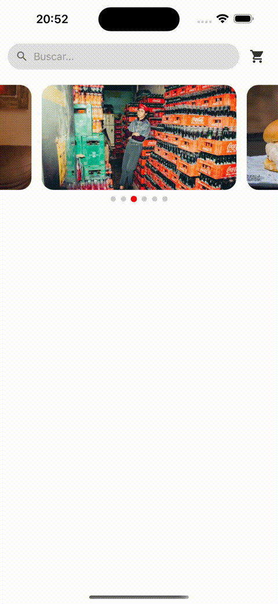

# React Native UI by @carlosxfelipe

[](https://www.npmjs.com/package/@carlosxfelipe/react-native-ui)

Reusable and customizable UI components for React Native apps.  
Built with TypeScript and ready to drop into your project.

## Installation

```bash
npm install @carlosxfelipe/react-native-ui
```

or

```bash
yarn add @carlosxfelipe/react-native-ui
```

## Components

### Carousel

An adaptive and touch-friendly image carousel component.

<p align="center">
  
</p>

#### Example Usage

```tsx
import React from "react";
import { View, Linking } from "react-native";
import { Carousel } from "@carlosxfelipe/react-native-ui";

// Example using local images with require (uncomment to use)
/*
const images = [
  {
    id: 1,
    source: require("../assets/pexels/pexels-photo-10764538.jpeg"),
  },
  {
    id: 2,
    source: require("../assets/pexels/pexels-photo-1066859.jpeg"),
  },
];
*/

// Example using remote images with URI
const images = [
  {
    id: 1,
    source: {
      uri: "https://images.pexels.com/photos/10764538/pexels-photo-10764538.jpeg",
    },
  },
  {
    id: 2,
    source: {
      uri: "https://images.pexels.com/photos/1066859/pexels-photo-1066859.jpeg",
    },
  },
];

const handlePressImage = (id: string | number) => {
  const links: Record<string | number, string> = {
    1: "https://www.linkedin.com/in/carlosxfelipe/",
    2: "https://github.com/carlosxfelipe",
  };

  const url = links[id];
  if (url) {
    Linking.openURL(url);
  } else {
    console.log("No action defined for image:", id);
  }
};

export default function App() {
  return (
    <View style={{ flex: 1, justifyContent: "center" }}>
      <Carousel
        images={images}
        showIndicators
        indicatorColor="red"
        onPressImage={handlePressImage}
        // autoplayInterval={5000}
      />
    </View>
  );
}
```

#### Props

| Prop               | Type                                                           | Description                                            |
| ------------------ | -------------------------------------------------------------- | ------------------------------------------------------ |
| `images`           | `Array<{ id: string \| number, source: ImageSourcePropType }>` | Image list with unique IDs and source URIs or require. |
| `height`           | `number`                                                       | Carousel height. Default: `180`.                       |
| `onPressImage`     | `(id: string \| number) => void`                               | Triggered when an image is pressed.                    |
| `autoplayInterval` | `number`                                                       | Interval for autoplay in ms. Default: `3000`.          |
| `showIndicators`   | `boolean`                                                      | Shows indicator dots. Default: `false`.                |
| `indicatorColor`   | `string`                                                       | Active indicator color. Default: `#000`.               |

## License

MIT
